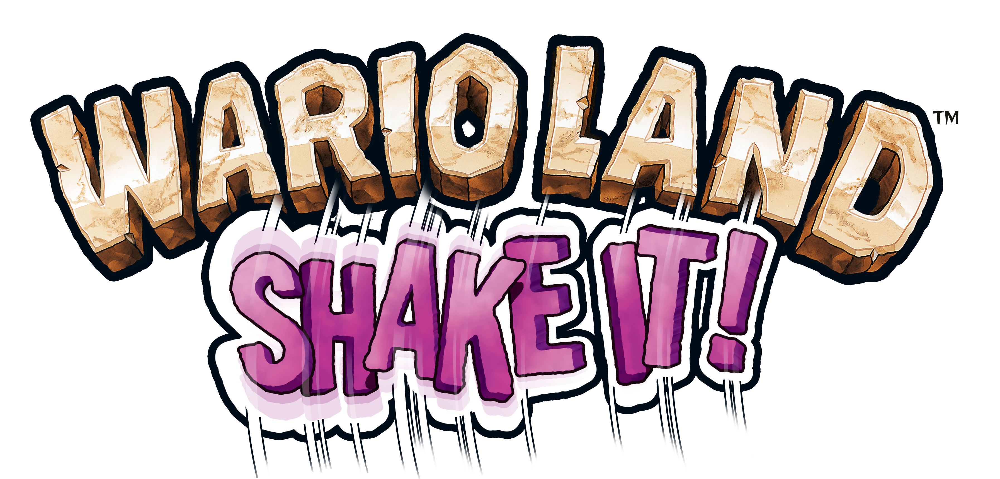

# Wario Land Patch

Play **Wario Land: Shake It!** / **Wario Land: The Shake Dimension** (Wii) with a
**GameCube controller** or a **Classic Controller** instead of shaking and tilting
a Wii Remote! Supports both **B/A Mode** (standard) and **Y/B Mode** (SNES / Wario
Land 4 layout). Works across all four regional releases: USA (`RWLE01`), Europe
(`RWLP01`), Japan Rev 1 (`RWLJ01`), and Korea (`RWLK01`).

The patches are applied directly to your own clean disc image (`.wbfs` or `.iso`):
drop your copy onto the patcher window and play the result on a Wii (USB loader)
or in Dolphin. Nothing copyrighted from the game is distributed in this repository.



## Highlights

- **GameCube Controller Support**: Native port 1 GameCube controller support via
  hardware Serial Interface (SI) auto-polling and extension report synthesis.
  Works seamlessly with or without a connected Wii Remote!
- **Classic Controller Support**: Built-in integration of Vague Rant and crediar's
  acclaimed Classic Controller v1.1 patch.
- **Two Button Layouts**:
  - **B/A Mode**: A jumps, B attacks/dashes, Y shakes, X confirms.
  - **Y/B Mode**: B jumps, Y attacks/dashes, X shakes, A confirms.
- **Full Analog Controls**:
  - Control stick (or CC left stick): Character movement and crouching.
  - C-stick (or CC right stick): Smooth tilting (submarines, minecarts, aiming throws).
  - Dedicated shake button (Y or X): Continuous ground pounds, enemy shaking, and bag rattling without tiring your arms!
- **All 4 Regional Releases Supported**:
  - `RWLE01`: *Wario Land: Shake It!* (USA)
  - `RWLP01`: *Wario Land: The Shake Dimension* (Europe)
  - `RWLJ01`: *Wario Land Shake* (Japan Rev 1)
  - `RWLK01`: *Wario Land Shaking* (Korea)

---

## Controls

### GameCube Controller

| Action | B/A Mode | Y/B Mode |
| --- | --- | --- |
| **Move / Duck** | Control Stick / D-Pad | Control Stick / D-Pad |
| **Tilt / Aim Throw** | C-Stick | C-Stick |
| **Jump** | **A** | **B** |
| **Dash Attack / Throw** | **B** | **Y** |
| **Shake / Ground Pound** | **Y** (or X) | **X** (or A) |
| **Confirm / Select** | **X** (or A) | **A** (or B) |
| **Cancel / Back** | **B** | **Y** |
| **Pause Menu (+)** | **Start** | **Start** |
| **Mission / Status (-)** | **Z** | **Z** |

*Note: GameCube controller connects to GameCube Port 1.*

### Classic Controller

| Action | B/A Mode | Y/B Mode |
| --- | --- | --- |
| **Move / Duck** | Left Stick / D-Pad | Left Stick / D-Pad |
| **Tilt / Aim Throw** | Right Stick | Right Stick |
| **Jump** | **A** | **B** |
| **Dash Attack / Throw** | **B** | **Y** |
| **Shake / Ground Pound** | **Y** | **X** |
| **Confirm / Select** | **X** | **A** |
| **Cancel / Back** | **B** | **Y** |
| **Pause (+)** | **+** | **+** |
| **Missions (-)** | **-** | **-** |

---

## Installing & Patching

### Graphical Patcher (GUI)

Download the standalone GUI patcher from the [Releases](https://github.com/quatric/Wario-Land-Patch/releases) page
(available for macOS, Windows, and Linux), or run it from source:

```bash
python3 tools/gui.py
```

1. Select your preferred **Button Mapping Mode** (**B/A Mode** or **Y/B Mode**).
2. Choose which controllers you want enabled (**Classic Controller** and/or **GameCube controller**).
3. Drop your clean `.wbfs` or `.iso` file onto the application window (or click to browse).
4. The patcher validates your disc against retail checksums, injects the routines into `sys/main.dol`,
   rebuilds the image in place, and preserves your untouched original as `<filename>.bak`.

### Command-Line Patcher (CLI)

Patch a disc image directly from the terminal:

```bash
# Standard B/A mode with both CC and GameCube pad enabled:
python3 tools/patch_disc.py "Wario Land Shake It.wbfs" --mode ba --cc --gc

# SNES/WL4 Y/B mode:
python3 tools/patch_disc.py "Wario Land Shake It.wbfs" --mode yb --cc-yb --gc-yb
```

Or patch an extracted `main.dol` file directly:

```bash
python3 tools/patcher.py main.dol main_patched.dol --mode ba --cc --gc
```

### Gecko Codes (Dolphin)

Pre-generated Gecko codes for each game ID are located in the `codes/` directory:
- `RWLE01.ini` / `RWLE01.txt` (USA)
- `RWLP01.ini` / `RWLP01.txt` (Europe)
- `RWLJ01.ini` / `RWLJ01.txt` (Japan)
- `RWLK01.ini` / `RWLK01.txt` (Korea)

Copy the `.ini` file into Dolphin's `Sys/GameSettings/` or your user `GameSettings/` folder.

### Riivolution

XML patches are provided in `riivolution/`:
- `RWLE01.xml`
- `RWLP01.xml`
- `RWLJ01.xml`
- `RWLK01.xml`

Place the XML file in `/riivolution/` on your SD card or USB drive.

---

## Credits & Acknowledgments

- **Vague Rant & crediar**: Original Classic Controller Gecko code implementations.
- **quatric**: GameCube SI hardware polling bridge, Classic Controller synthesis engine, patcher tools, Riivolution patches, and multi-region porting.
- **Good-Feel & Nintendo**: *Wario Land: Shake It!*

## License

This project is licensed under the [MIT License](LICENSE).

### Modded images

Disc patchers match the first four characters of the game ID (ID4), so mods can change the last two characters. The original disc ID and filename are preserved. Revision and executable patch-site checks still apply; mods that change required code may be incompatible.
